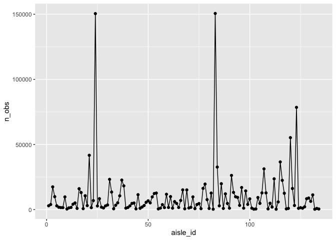

p8105_hw3_lvr2115
================
Laura Robles-Torres
2023-10-10

``` r
library(p8105.datasets)
data("instacart")
library(tidyverse)
```

    ## ── Attaching core tidyverse packages ──────────────────────── tidyverse 2.0.0 ──
    ## ✔ dplyr     1.1.3     ✔ readr     2.1.4
    ## ✔ forcats   1.0.0     ✔ stringr   1.5.0
    ## ✔ ggplot2   3.4.3     ✔ tibble    3.2.1
    ## ✔ lubridate 1.9.2     ✔ tidyr     1.3.0
    ## ✔ purrr     1.0.2     
    ## ── Conflicts ────────────────────────────────────────── tidyverse_conflicts() ──
    ## ✖ dplyr::filter() masks stats::filter()
    ## ✖ dplyr::lag()    masks stats::lag()
    ## ℹ Use the conflicted package (<http://conflicted.r-lib.org/>) to force all conflicts to become errors

``` r
library(dplyr)
```

# Problem 1

The dataset is 1384617 rows and 15 columns. The 15 variables are
add_to_cart_order, aisle, aisle_id, days_since_prior_order, department,
department_id, eval_set, order_dow, order_hour_of_day, order_id,
order_number, product_id, product_name, reordered, user_id.

How many aisles are there, and which aisles are the most items ordered
from?

``` r
instacart |> 
  group_by (aisle_id) |>
  summarize(n_obs=n()) |>
    arrange(desc(n_obs))
```

    ## # A tibble: 134 × 2
    ##    aisle_id  n_obs
    ##       <int>  <int>
    ##  1       83 150609
    ##  2       24 150473
    ##  3      123  78493
    ##  4      120  55240
    ##  5       21  41699
    ##  6      115  36617
    ##  7       84  32644
    ##  8      107  31269
    ##  9       91  26240
    ## 10      112  23635
    ## # ℹ 124 more rows

There are 134 aisles and the aisles from which the most items are
ordered from are 83, 24, and 123.

Make a plot that shows the number of items ordered in each aisle,
limiting this to aisles with more than 10000 items ordered. Arrange
aisles sensibly, and organize your plot so others can read it.

``` r
instacart |>
  group_by(aisle_id) |>
  summarize(n_obs = n()) |>
  ggplot(aes(x = aisle_id, y = n_obs)) + 
    geom_point() + geom_line() + 
    theme(legend.position = "bottom")
```

<!-- -->

Make a table showing the three most popular items in each of the aisles
“baking ingredients”, “dog food care”, and “packaged vegetables fruits”.
Include the number of times each item is ordered in your table.

Make a table showing the mean hour of the day at which Pink Lady Apples
and Coffee Ice Cream are ordered on each day of the week; format this
table for human readers (i.e. produce a 2 x 7 table).
