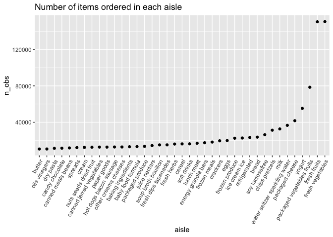

p8105_hw3_lvr2115
================
Laura Robles-Torres
2023-10-10

``` r
library(p8105.datasets)
data("instacart")
library(tidyverse)
library(dplyr)
```

``` r
instacart = 
  instacart |> 
  as_tibble()
```

# Problem 1

The dataset is 1384617 rows and 15 columns. The 15 variables are
add_to_cart_order, aisle, aisle_id, days_since_prior_order, department,
department_id, eval_set, order_dow, order_hour_of_day, order_id,
order_number, product_id, product_name, reordered, user_id. Each row in
this dataset represents an object that was ordered from Instacart. There
are variables to identify the order itself, including user ID
(‘user_id’), the order in which items were added to the cart
(‘add_to_cart_order’), and the order ID (‘order_id’). There are
variables to describe the items ordered per say, such as department
(‘department’ and ‘department_id’), the name of the product
(‘product_name’), and the aisle in which the product is found (‘aisle’
and ‘aisle_id’), and whether or not the item has been ordered by this
user previously (‘reordered’). In total, there are 39123 products found
in 131209 orders from 131209 distinct users.

How many aisles are there, and which aisles are the most items ordered
from?

``` r
instacart |> 
  group_by (aisle) |>
  summarize(n_obs=n()) |>
    arrange(desc(n_obs))
```

    ## # A tibble: 134 × 2
    ##    aisle                          n_obs
    ##    <chr>                          <int>
    ##  1 fresh vegetables              150609
    ##  2 fresh fruits                  150473
    ##  3 packaged vegetables fruits     78493
    ##  4 yogurt                         55240
    ##  5 packaged cheese                41699
    ##  6 water seltzer sparkling water  36617
    ##  7 milk                           32644
    ##  8 chips pretzels                 31269
    ##  9 soy lactosefree                26240
    ## 10 bread                          23635
    ## # ℹ 124 more rows

There are 134 aisles and the aisles from which the most items are
ordered from are fresh vegetables and fresh fruits.

This plot shows the number of items ordered in each aisle, only
including aisles with more than 10000 items ordered, shown in ascending
order.

``` r
instacart |>
  group_by(aisle) |>
  summarize(n_obs = n()) |>
  filter(n_obs > 10000) |> 
      mutate(aisle = fct_reorder(aisle, n_obs)) |> 
  ggplot(aes(x = aisle, y = n_obs)) + 
    geom_point() + geom_line() + 
    labs(title = "Number of items ordered in each aisle") +
    theme(axis.text.x = element_text(angle = 60, hjust = 1))
```

<!-- -->

This table shows the three most popular items in each of the aisles
“baking ingredients”, “dog food care”, and “packaged vegetables fruits”,
including the number of times each item is ordered.

``` r
instacart |>
  filter(aisle %in% c("baking ingredients", "dog food care", "packaged vegetables fruits")) |>
  group_by(aisle) |>
  count(product_name) |>
  mutate(rank = min_rank(desc(n))) |> 
  filter(rank <=3) |> 
  arrange(desc(n)) |>
  knitr::kable()
```

| aisle                      | product_name                                  |    n | rank |
|:---------------------------|:----------------------------------------------|-----:|-----:|
| packaged vegetables fruits | Organic Baby Spinach                          | 9784 |    1 |
| packaged vegetables fruits | Organic Raspberries                           | 5546 |    2 |
| packaged vegetables fruits | Organic Blueberries                           | 4966 |    3 |
| baking ingredients         | Light Brown Sugar                             |  499 |    1 |
| baking ingredients         | Pure Baking Soda                              |  387 |    2 |
| baking ingredients         | Cane Sugar                                    |  336 |    3 |
| dog food care              | Snack Sticks Chicken & Rice Recipe Dog Treats |   30 |    1 |
| dog food care              | Organix Chicken & Brown Rice Recipe           |   28 |    2 |
| dog food care              | Small Dog Biscuits                            |   26 |    3 |

This table shows the mean hour of the day at which Pink Lady Apples and
Coffee Ice Cream are ordered on each day of the week (0-6).

``` r
instacart |>
filter(product_name%in% c("Pink Lady Apples", "Coffee Ice Cream")) |>
group_by(product_name, order_dow) |>
summarize (
  mean_hod=mean(order_hour_of_day, na.rm=TRUE)
) |>
pivot_wider(
    names_from = order_dow, 
    values_from = mean_hod) |>
  knitr::kable(digits = 1)
```

| product_name     |    0 |    1 |    2 |    3 |    4 |    5 |    6 |
|:-----------------|-----:|-----:|-----:|-----:|-----:|-----:|-----:|
| Coffee Ice Cream | 13.8 | 14.3 | 15.4 | 15.3 | 15.2 | 12.3 | 13.8 |
| Pink Lady Apples | 13.4 | 11.4 | 11.7 | 14.2 | 11.6 | 12.8 | 11.9 |

# Problem 2

``` r
library(p8105.datasets)
data("brfss_smart2010")
```

## Data cleaning

``` r
brfss_smart2010_clean = janitor::clean_names(brfss_smart2010)
brfss_smart2010_overallhealth = filter(brfss_smart2010_clean, topic=="Overall Health" | response=="Excellent:Poor") |>
  mutate(recode_factor(response, "Poor" = "1", "Fair" = "2", "Good" = "3", "Very Good" = "4", "Very good" = "4", "Excellent" = "5"))
```
